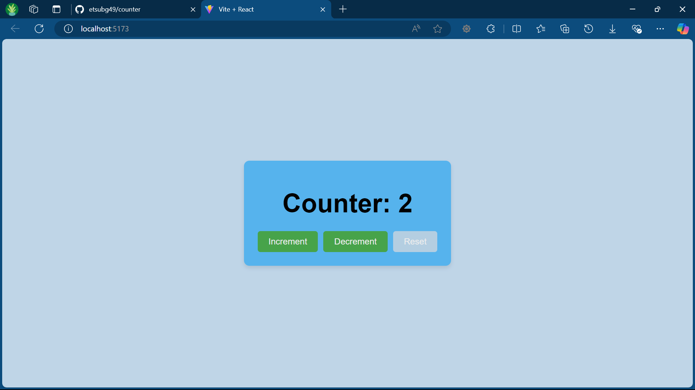

# Counter App

## Description
This is a simple and user-friendly Counter application built using React and Vite. The app includes a display area to show the counter value and buttons to increment, decrement, and reset the counter. It is styled with CSS to enhance its visual appeal.

## Installation

### Prerequisites
To run this project locally, you need to have Node.js and npm installed on your machine.

### Steps
1. **Clone the repository**:
   ```bash
   git clone https://github.com/etsubg49/counter.git
   cd counter-app
2. **Install dependencies**:
    ```bash
    npm install
3. **Run the development server**:
    ```bash
    npm run dev
4. **Open your browser**:
    and navigate to http://localhost:3000 to see the app in action.
## Usage

**Increment**: Click the "Increment" button to increase the counter value by 1.

**Decrement**: Click the "Decrement" button to decrease the counter value by 1.

**Reset**: Click the "Reset" button to reset the counter value to 0.
## Screenshots
### Main Interface

## Author
Etsubdink Gashaw- etsubg49